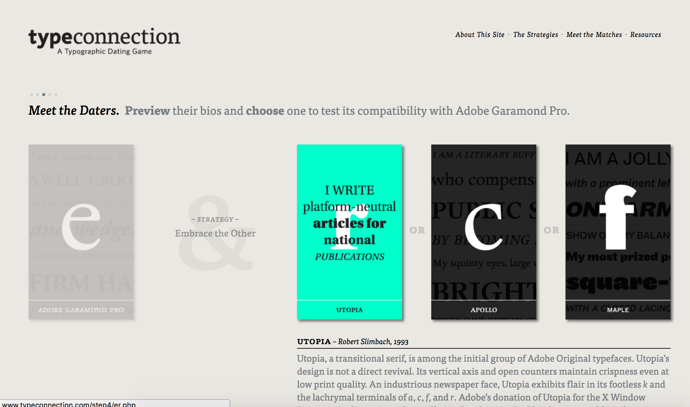
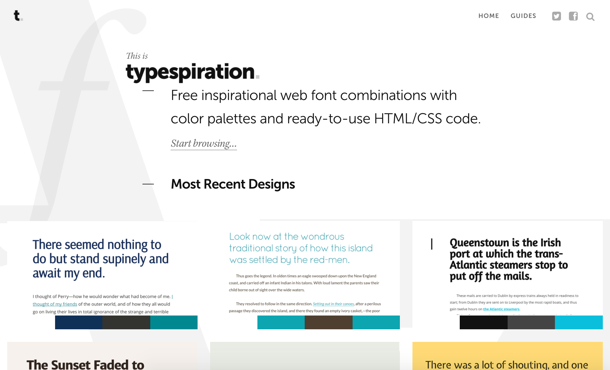
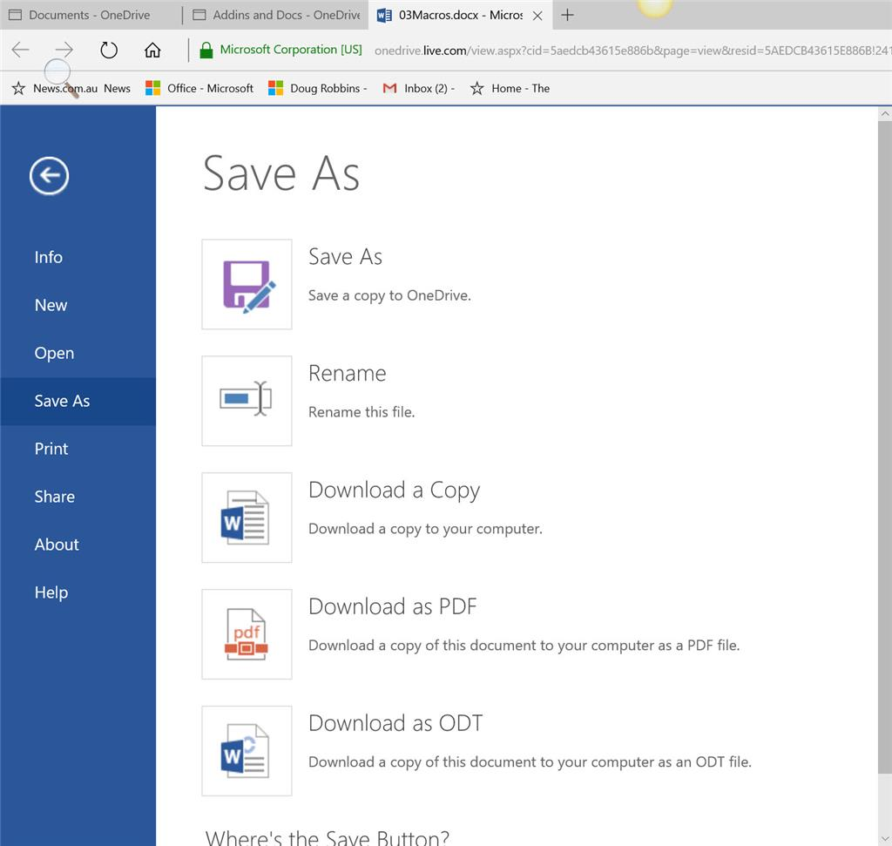
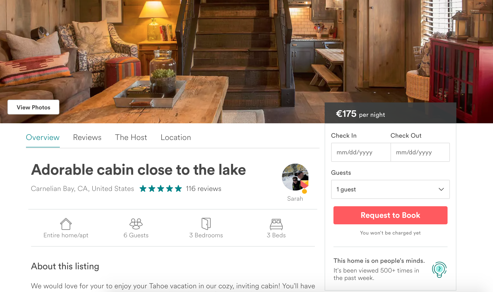
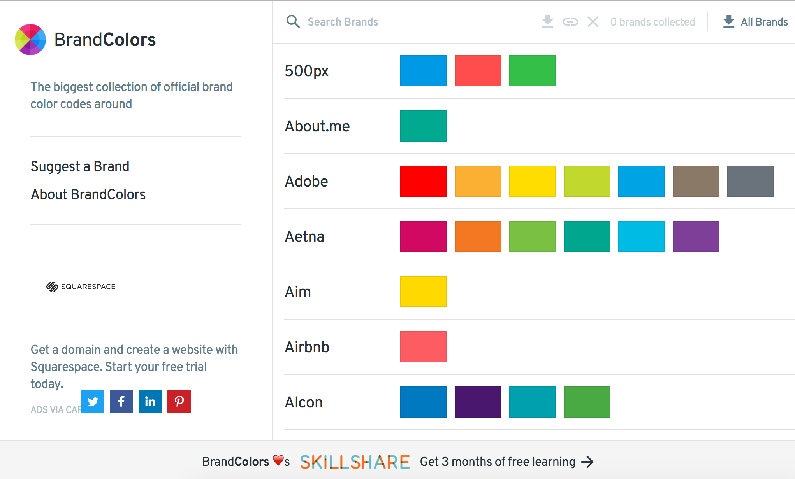
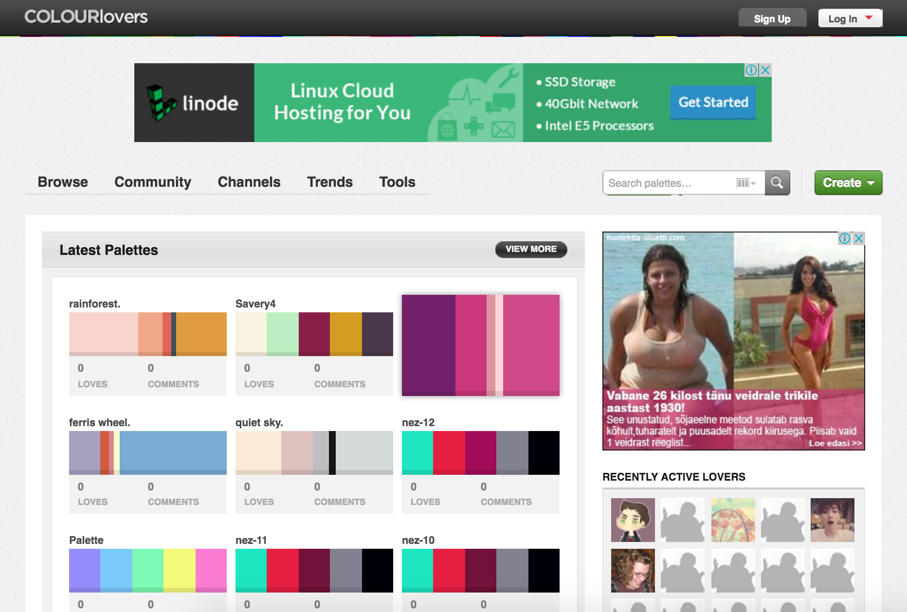
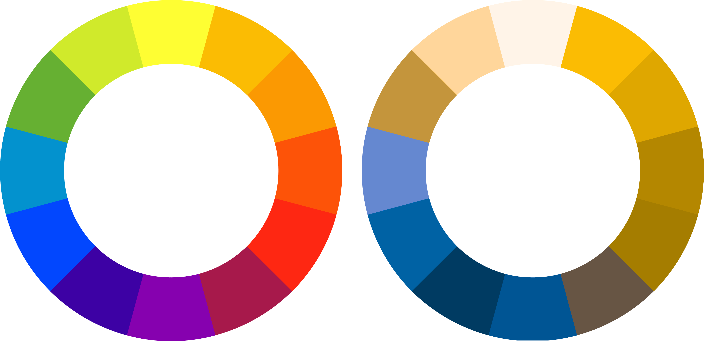

# Visuaalne disain

---

https://www.youtube.com/watch?v=BibWZJOClgU

---

# Millised on visuaalse disaini "ehituskivid"?

&nbsp;

---

# Millised on visuaalse disaini "ehituskivid"?

1. Kirjad

2. Ikoonid

3. Värvid

4. Fotod, illustratsioonid, mustrid jne

5. Kompositsioon

---

# 1. Kirjad

---

## Kirjad

~~Tüpograafia teooria~~

Kuidas kirju **valida**

Kuidas kirju **kasutada**

Kuidas mitut kirja **kombineerida**

---

---

##### https://fonts.google.com/

---

# Praktiline ülesanne

http://kristjanjansen.ee/kasutajaliidesed1

---

[[typo text1.md]]

---

[[typo text2.md]]

---

[[typo text3.md]]

---

# Kirjad

### Kirjade kombineerimine

http://www.typeconnection.com

http://typespiration.com/

---

---

---

# Kirjad

### Kuid kas keegi üldse loeb tekste?

> People do not read. People rarely read Web pages word by word; instead, they scan the page, picking out individual words and sentences.

https://www.nngroup.com/articles/how-users-read-on-the-web/

> On the average Web page, users have time to read at most 28% of the words during an average visit; 20% is more likely.

https://www.nngroup.com/articles/how-little-do-users-read/

---

# Kirjad

### Aga samas

> Write better words, not less words. Write for your friend. Edit relentlessly. Forget about Jakob’s 20% rule. Make your writing 100% worth reading, and people will read it.

https://signalvnoise.com/posts/3633-on-writing-interfaces-well

---

# 2. Ikoonid

---

---

---

---

---

---

---

# Ikoonid

### Miks?

&nbsp;

---

# Ikoonid

### Konstrueerimine

&nbsp;

---

---

---

---

# Ikoonid

### Enne ja nüüd

http://getbootstrap.com/components/

http://streamlineicons.com

---

# Ikoonid

### Formaadid

Bitmapid → Spraidid → Ikoonifondid → SVG → SVG spraidid

https://icomoon.io/

---

# Ikoonid

### Kas metafoor alati töötab?

&nbsp;

---

# 💾

---

---

# Praktiline ülesanne

### \#kasutajaliidesed

&nbsp;

---

# Emoji 

&nbsp;

---

# 🍌🍉🍇😢😭😓👹👺💩 👻👾🎃😹😻🙀🌚🌝🌞 🙏👍👎👗👙👖📖📰📝 📟📠📺🎺🎸🎻🏐🏉🎱 💗💖💝🐉🐲🌵🚝🚄🚅

---

# 🏩

---

# 👫

---

# 👬 👫 👭

---

# 🖐🏻🖐🏼🖐🏽🖐🏾🖐🏿

---

---

# Ikoonid

### Lisaks

http://iconutopia.com/files/Icon-Design-Guide-by-IconUtopia.pdf

---

# 3. Värvid

---

[[color #FF5A5F,#007A87,#565A5C,#CED1CC]]

---

---
[[color #4285f4,#34a853,#fbbc05,#ea4335]]

---

[[color #ff9900,#146eb4]]

---

[[color #ed1c16,#cd201f]]

---

[[color #3b5998,#00aff0]]

---

---

# Värvid

### Kombineerimine

Monochromatic

Analogous

Complementary

---

[[wheel2 ]]

---

https://www.youtube.com/watch?v=A6M2cNlCwRc

---

# Värvid

### Kuidas neid _tegelikult_ valida?

&nbsp;

---

---

#### https://coolors.co/app

---

### https://dribbble.com/colors/3080e8

---

# Värvid

### Värvipimedus

**_7%_** meestel / **_0.5%_** naistel

---

---

---

# Värvid

### Värvipimeduse ja vaegnägemise testid

https://material.io/color/#!/

https://www.smashingmagazine.com/2016/06/improving-ux-for-color-blind-users/#tooling

### Lisaks

https://www.smashingmagazine.com/tag/colors/

https://github.com/Siddharth11/Colorful

---

# 4. Fotod

---

# Fotod

### Enne: Stock photo

&nbsp;

---

---

---

---

---

---

# Fotod

### Nüüd: Hipster stock photo

&nbsp;

---

#### https://zoommyapp.com

---

# Fotod

### Muu illustratiivne materjal

Mustrid

Illustratsioon

Infograafika

Interaktiivsed elemendid

---

#### https://www.heroku.com

---

#### http://qrohlf.com/trianglify

---

#### http://acko.net/

---

# 5. Kompositsioon

---

https://www.youtube.com/watch?v=a5KYlHNKQB8&index=61&list=WL

---

# Kompositsioon

||
|----|----|
|**Proximity**|Elementide lähedus|
|**White space**|Vaba ruum|
|**Alignment**|Joondamine|
|**Contrast**|Kontrast|
|**Repetition / Concistency**|Ühtsus|

---

# Praktiline ülesanne

### \#kasutajaliidesed

&nbsp;

---

[[typo2 text4.md]]

---

# Ja nüüd

### Jaguneme rühmadesse

&nbsp;
