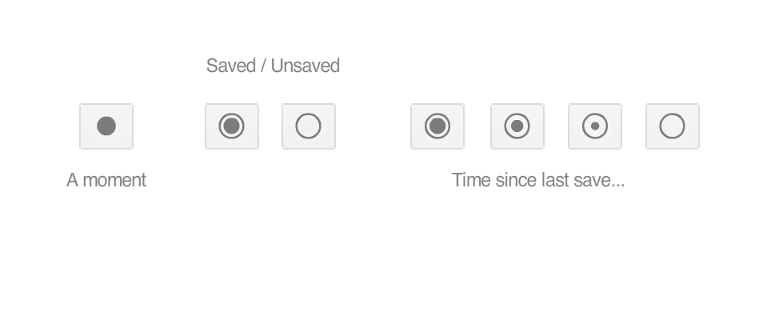

# Kasutajaliideste kavandamine

MTAT.03.032

Esimene kohtumine

---

# Slaidid:

http://kristjanjansen.ee/kasutajaliidesed1

# Hastag:

\#kasutajaliidesed

---

# Kristjan Jansen

Skype interaktsioonidisainer

Porto Tech Center'i disainijuht

Pro Eksperdi andmevisualiseerija

Disainiõppejõud

http://kristjanjansen.ee/

---

# Kursuse osad

|||
|----|----|----|
|**R 21. aprill**|Visuaalne disain|
|**R 28. aprill**|Interaktsioonidisain|
|**29.mai - 18.mai**|**_Kodutöö_**|
|**R 19. mai**|Disaineri tööprotsess|
|**R 26. mai**|Kasutajaliideste tulevik|

---
# Täna räägime

### Disaini ehitusplokid

Tekst
Ikoonid
Värvid
Fotod
Illustratsioonid
K

---

[[typo text1.md]]

---

[[typo2 text4.md]]

---

# 🍌🍉🍇😢😭😓👹👺💩 👻👾🎃😹😻🙀🌚🌝🌞 🙏👍👎👗👙👖📖📰📝 📟📠📺🎺🎸🎻🏐🏉🎱 💗💖💝🐉🐲🌵🚝🚄🚅

---

# ☰

### Hamburger menu

---

# 1981 Norm Cox / Xerox PARC

https://vimeo.com/61556918

21:10

---

# ⋮

### Kebab menu

## Tekst / Kiri / Tüpograafia

~~Teooria~~
Kuidas kirju valida
Kuidas kirju kujundada
Kuidas kirju kombineerida

---

[[typo ./text1.md]]

---

[[typo ./text2.md]]

---

[[typo ./text3.md]]

---

# Kodune ülesanne

http://jgthms.com/web-design-in-4-minutes/

---

## Kas keegi üldse loeb tekste?

> People do not read. People rarely read Web pages word by word; instead, they scan the page, picking out individual words and sentences.

https://www.nngroup.com/articles/how-users-read-on-the-web/

> On the average Web page, users have time to read at most 28% of the words during an average visit; 20% is more likely.

https://www.nngroup.com/articles/how-little-do-users-read/

---

## Aga siiski...

> Write better words, not less words. Write for your friend. Edit relentlessly. Forget about Jakob’s 20% rule. Make your writing 100% worth reading, and people will read it.

https://signalvnoise.com/posts/3633-on-writing-interfaces-well

---

# Ikoonid

Miks?

"Tänapäeva koopamaalid"

---

# Ikoonid

Stiilid

---

---

---

---

---

---

---

## Ikoonid

Konstrueerimine

---

---

---

---

## Ikoonid

Metafoor

---

# 💾

---

---

---

# Ikoonid

Kust neid saada?

---

http://getbootstrap.com/components/

---

http://streamlineicons.com

---

https://icomoon.io/

---

# Ikoonid

Emoji 

---

# 🏩

---

# 👫

---

# 👬 👫 👭

---

# 🖐🏻🖐🏼🖐🏽🖐🏾🖐🏿

---

---

# Värvid

---

[[color #FF5A5F,#007A87,#565A5C,#CED1CC]]

---

---
[[color #4285f4,#34a853,#fbbc05,#ea4335]]

---

[[color #ff9900,#146eb4]]

---

[[color #ed1c16]]

---

[[color #00704a]]

---

[[color #3b5998]]

---

[[color #00aff0]]

---

---

# Värvid

Süsteem

https://www.youtube.com/watch?v=A6M2cNlCwRc

---

# Värvid

Valik

---

---

https://coolors.co/app

---

https://dribbble.com/colors/3080e8

---

# Värvid

Värvipimedus

**_7%_** meestel / **_0.5%_** naistel

http://www.colourblindawareness.org/colour-blindness/

---

---

# Kompositsioon

---

https://www.youtube.com/watch?v=a5KYlHNKQB8&index=61&list=WL

---

# Foto

Stock

---

---

---

---

---

---

# Foto

Hipsterstock

---

https://unsplash.com
https://www.pexels.com

---

https://zoommyapp.com

---

# Illustratsioon

...

---

https://www.heroku.com

---

# Patterns

...

---

http://www.sociali.st

---

http://qrohlf.com/trianglify

---

http://carbure.co/

---

http://acko.net/
