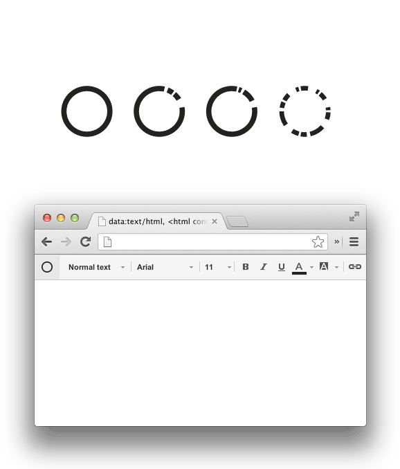

Miks neid vaja on?
Kust neid saab?
Mis neist edasi saab?

---

## Susan Kare

---

---

---

---

---

---

---

---

---

Veel värvikasutusest

* https://www.smashingmagazine.com/tag/colors/
* https://github.com/Siddharth11/Colorful

---

Microinteractions

https://www.dropbox.com/

---

---
https://design.tutsplus.com/articles/know-your-icons-part-1-a-brief-history-of-computer-icons--psd-9805

---

https://dribbble.com/colors/3080e8?s=popular
https://material.io/color/

### Täiendvärvid

---

---

http://kristjanjansen.ee/files/sky/index.html

---

Complementary

---

---

https://www.youtube.com/watch?v=zVw86emu-K0

---

 Google dots

https://dribbble.com/colors/3080e8?s=popular

---

http://kristjanjansen.ee/files/sky/index.html

---

---

---

---

---

# Illustratsioonid

---

---

---

---

# Illustratsioonide animatsioon

---

---

http://www.polygon.com/a/xbox-one-review
http://www.polygon.com/a/ps4-review/ps4-review/

https://connoratherton.com/walkway
http://maxwellito.github.io/vivus/

---

---

---

# Värv

Kodus vaatamiseks

https://www.smashingmagazine.com/tag/colors/
https://github.com/Siddharth11/Colorful

# Whitespace

* Allows for easier readability and scannability
* Prioritizes user interface elements
* Guides users on a page
* Can create the feeling of sophistication and elegance
* Is essential for a balanced, harmonious layout

---

# Whitespace II

* Increased Content Legibility:
* More Interaction
* Ability to Highlight Call to Actions (CTAs)
* A Tidy Site Equals an Impressive Site
* Creating Balance
* Acts as a Separator
* Designer vs. Developer / Fold / Explain

---

## Allikad

http://uxmyths.com/post/2059998441/myth-28-white-space-is-wasted-space
http://www.seguetech.com/whitespace-web-design/

https://alistapart.com/article/whitespace

